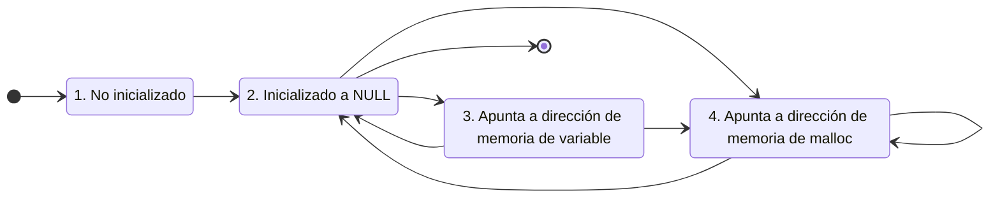

# Mini laboratorio de lenguaje C

### Materiales usados en ARCOS.INF.UC3M.ES con Licencia [CC BY-NC 4.0](http://creativecommons.org/licenses/by-nc/4.0/) 


## Requisitos

Los principales requisitos son:
* Tener acceso a una máquina con Linux
* Tener conexión a Internet

Para tener acceso a una máquina con Linux se recuerda que el Laboratorio del Departamento de Informática ofrece unas Aulas Virtuales en:
* ["https://www.lab.inf.uc3m.es/servicios/aulas-virtuales-del-laboratorio/](https://www.lab.inf.uc3m.es/servicios/aulas-virtuales-del-laboratorio/)


## Ejemplo de código para compilar

Usaremos el archivo:

* main.c
  ```c
  #include <stdio.h>
  
  int main ( int argc, char *argv[] )
  {
     printf("Hola mundo...\n") ;
     return 0 ;
  }
  ```

Para compilar usaremos:

```bash
gcc -g -Wall -c main.c -o main.o
gcc -g -Wall -o main      main.o
```

A la hora de compilar se utiliza los siguientes modificadores (flags):
* "-g" para añadir información de depuración que es útil si se usa un depurador
* "-Wall" para que muestre todas las advertencias (Warnings) de posibles problemas que detecte el compilador

Se podría usar también:
* "-Werror" para indicar que trate todas las advertencias (warnings) como errores.
* "-std=c90 -pedantic" para indicar que use el estándar de C versión 90 de forma extricta sin extensiones de GNU adicionales.


## Ejemplo de uso de sentencias de control de flujo en C

Usaremos el archivo:

* main.c
  ```c
  #include <stdio.h>
  
  int main ( int argc, char *argv[] )
  {
     int i ;
     int print_intro ;

     for (i=0; i<100; i++)
     {
        print_intro = 0 ;
        printf("%d -> ", i) ;

        if ((i % 3) == 0)
        {
            printf("Fizz") ;
            print_intro = 1 ;
        }
        if ((i % 5) == 0)
        {
            printf("Buzz") ;
            print_intro = 1 ;
        }

        if (print_intro)
            printf("\n") ;
     }

     return 0 ;
  }
  ```

Información recomendada:
* ["Sentencias de control (youtube)](http://www.youtube.com/watch?embed=no&v=ux_J98WmjPA&feature=related)


## Ejemplo de array de structs

Usaremos el archivo:

* main.c
  ```c
  #include <stdio.h>
  #include <stdlib.h>

  #define N_PERSONAS 100

  struct dni {
     int  id ;
     char nombre[128] ;
  } ;

  struct dni personas[N_PERSONAS] ;
  
  int main ( int argc, char *argv[] )
  {
     int i ;

     /* rellenar personas con valores por defecto (persona 0,1...) */
     for (i=0; i<N_PERSONAS; i++)
     {
        sprintf("persona %d", personas[i].name, personas[i].id) ;
        personas[i].id = i ;
     }

     /* imprimir personas */
     for (i=0; i<N_PERSONAS; i++)
     {
        printf(" * Persona '%s' con id '%d'.\n",
                           personas[i].name,
                                       personas[i].id) ;
     }

     return 0 ;
  }
  ```

Información recomendada:
* ["Array y Struct en C (youtube)](http://www.youtube.com/watch?embed=no&v=o5Jl_Dzga88&feature=related)


## Ejemplo de uso de punteros para memoria dinámica

Usaremos el archivo:

* main.c
  ```c
  #include <stdio.h>
  #include <stdlib.h>

  // para un array estático (de tamaño fijo, en tiempo de compilación)
  int  earray[5]  = { 1, 2, 3, 4, 5 } ;

  // para un array dinámico (tamaño variable fijado en ejecución)
  int *darray  = NULL ;
  int  n_eltos = 0 ;

  void imprimir ( int *vector, int n_eltos )
  {
      int i ;

      for (i=0; i<n_eltos; i++)
      {
           printf(" >> vector[%d] = %d\n", i, vector[i]) ;
      }
  }

  int main ( int argc, char *argv[] )
  {
      earray[0] = 1 ;
      earray[1] = 2 ;
      earray[2] = 3 ;
      earray[3] = 4 ;
      earray[4] = 5 ;
  //  earray[5] = 5 ;  !!  fuera de rango

      // darray  vale NULL aquí ;
      // n_eltos vale cero aquí ;

      // vamos a pedir memoria para 2 enteros
      n_eltos = 2 ;  // <- en un futuro en lugar de 2 se pasará por argc/argv el número...
      darray = malloc(n_eltos * sizeof(int)) ;

      // vamos a comprobar que malloc NO ha devuelto NULL
      if (NULL == darray) {
          perror("malloc ha fallado: ") ;
          exit(-1) ;
      }

      // darray  vale aquí la posición de memoria donde hay espacio para guardar 2 enteros ;
      // n_eltos vale 2 aquí ;
      darray[0] = 1 ;
      darray[1] = 2 ;

   // darray    = 1 ;  !!  darray almacena la dirección 0x1 de memoria pero no se guarda 1 en el primer elemento
   // darray[2] = 3 ;  !!  fuera de rango

      printf("Estático:\n") ;
      imprimir(earray, 5) ;

      printf("Dinámico:\n") ;
      imprimir(darray,  n_eltos) ;
   // imprimir(&darray, n_eltos) ;  !! dirección de la variable que guarda la dirección del primer elemento...

      return 0 ;
  }
  ```


Información recomendada:
* ["Introducción a punteros  I (youtube)](http://www.youtube.com/watch?embed=no&v=iQF-2vUNEJk&feature=related)
* ["Introducción a punteros II (youtube)](http://www.youtube.com/watch?embed=no&v=m6sdKI3zhKg&feature=related)


Estados en el uso recomendado de un puntero:


